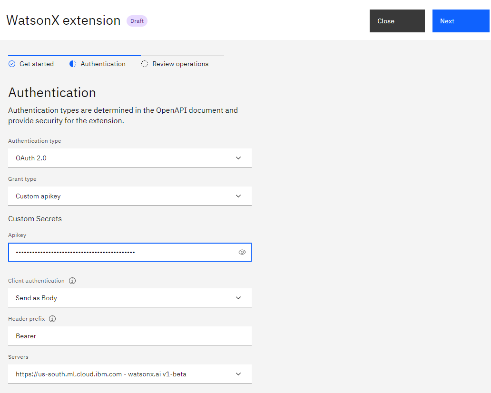
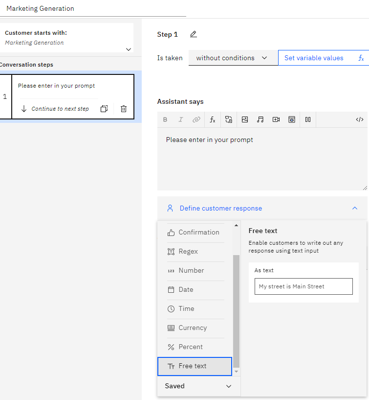

This example covers the use case showing end to end integration of WA with Watsonx.ai showing the value of customer care scenario enhanced via generative ai

### Step 1 - Download the json extension.

First we need to download the following json file https://github.com/watson-developer-cloud/assistant-toolkit/blob/master/integrations/extensions/starter-kits/language-model-watsonx/watsonx-openapi.json

### Step 2 - Create your Watson Assistant at IBM Cloud

Then we need to create our Watson Assistant.

https://www.ibm.com/products/watson-assistant/artificial-intelligence

After it is created we go to **Integrations**


then we go to **Extensions** and click Build custom extension


We click next and then we can name like WatsonX extension then next and we attach our wasonx-openapi.json


then we have to add the **WatsonX** extension to Watson Assistant by click in Add


you click Add


During the setup of this extension, you require to get the API of the WatsonX.

### Step 3 - Create WatsonX account

To get his, first you need to go to your WatsonX account

https://www.ibm.com/watsonx


### Step 4 - Create a prompt Lab

Then you can open the **Experiment** with the foundation models with **Prompt Lab**

Let us choose an simple example like **Marketing Generation**


### Step 5 - Create personal API key

then under the view code we click create personal API key


then we create our API key


### Step 6- Setup WatsonX extension

then we copy it and we paste in our WatsonX extension



then we save and finish


### Step 7- Setup Watson Assistant with WatsonX

We return back to our Watson Assistant and we can create an action


for example Marketing Generation


We create the first step, we can say

**ADD**

and then we define a customer response like Free text



then we create an extra step, the step we name

**Call watson extension**

and then we continue to next step by using an extension


In order to setup the extension you requiere to go back to your WatsonX and see the code

in my example will have something like

```
curl "https://us-south.ml.cloud.ibm.com/ml/v1-beta/generation/text?version=2023-05-29" \
  -H 'Content-Type: application/json' \
  -H 'Accept: application/json' \
  -H 'Authorization: Bearer YOUR_ACCESS_TOKEN' \
  -d $'{
  "model_id": "google/flan-t5-xxl",
  "input": "Generate a 5 sentence marketing message for a company with the given characteristics.\\n\\nDetails\\nCharacteristics:\\n\\nCompany - Golden Bank\\n\\nOffer includes - no fees, 2% interest rate, no minimum balance\\n\\nTone - informative\\n\\nResponse requested - click the link\\n\\nEnd date - July 15\\n\\nEmail\\n",
  "parameters": {
    "decoding_method": "sample",
    "max_new_tokens": 200,
    "min_new_tokens": 50,
    "random_seed": 111,
    "stop_sequences": [],
    "temperature": 0.8,
    "top_k": 50,
    "top_p": 1,
    "repetition_penalty": 2
  },
  "project_id": "MY_PROJECT_ID"
}'
```

we will use the previous information to setup our extension in Watson Assistant

    For the version you will use a text with 2023-05-29

    For input you will choose Action Step Variables and then you choose the first step 1.Please enter in your promt


For model_id google/flan-t5-xxl

for project_id you paste your project id for example 4asdasdds-56ed-4eea-b36d you will have something like


then for this example we will requiere additional options


then click apply. Then we create a new step, with conditions,
we choose WatsonX extension(step2)


then Ran successfully


in order to express code we set variable values, and we create a New session variable


we name result and will be free text and then apply.


then we click set variable values and then expression


then we type in the value of the variable


and search action step variables


and select 1.Please enter in your propmt. Then you add an space then ` + “ “$ and find WatsonX extension(step2)`


then click on Body.results


and you are going to have something like this


due to you get an array, you add the following [0]["generated_text"] that together in my case in something like this


then in the assitant says you add a function result


and finally we click on preview.
